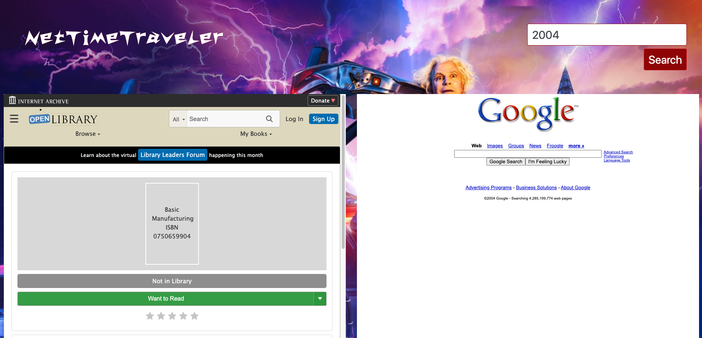

# Net Time Traveler

## Project Description 

NetTimeTraveler is an application that allows a user to travel back in time to a specific website archive and retrieves a book that was published in the same year.

## User Story

As a user when I open the NetTimeTraveler application. I see an input for a search field for a [Year between 2000 and 2020]. When I enter the year a Giphy from the movie “Back to the Future”appears and it takes me back through the internet archives and a random website that correlates with the year I entered loads on the screen and a random book with a publish year that matches the input year appears on the screen beside the website from the internet archives. Then as a user my life is complete.

## Criteria

* Use a CSS framework other than Bootstrap.
* Be deployed to GitHub Pages.
* Be interactive (i.e., accept and respond to user input).
* Use at least two server-side APIs.
* Does not use alerts, confirms, or prompts (use modals).
* Use client-side storage to store persistent data.
* Be responsive.
* Have a polished UI.
* Have a clean repository that meets quality coding standards (file structure, naming conventions, follows best practices for class/id naming conventions, indentation, quality comments, etc.).
* Have a quality README (with unique name, description, technologies used, screenshot, and link to deployed

## Challenges

The main challenge for the group was working with books and the associated information within the API. On occasion we ran into books where the “Publish Year” (key used in our query) was represented for every year within the 20 year search criteria, e.g “Hamlet”   offered by our site.  The team also experienced this same issue with ISBN “International Standard Book Number “ where there was over 700 entries spread over 4 arrays for one book “ Hamlet”

## Credits

Wayback Machine (https://archive.org/help/wayback_api.php)
Open Library (https://openlibrary.org/dev/docs/api/books)

## License

© NetTimeTraveler. All Rights Reserved. Under the [MIT/](./license.txt) license.
